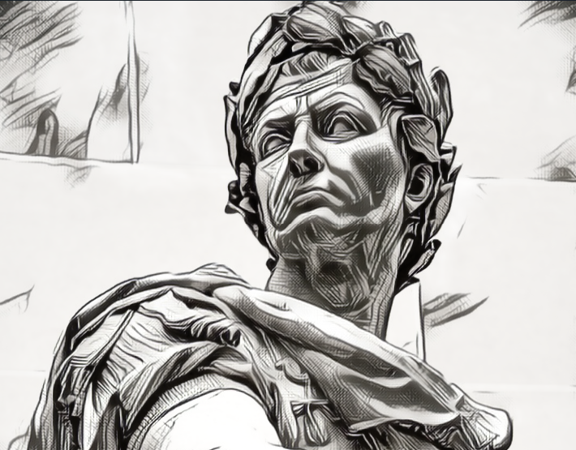
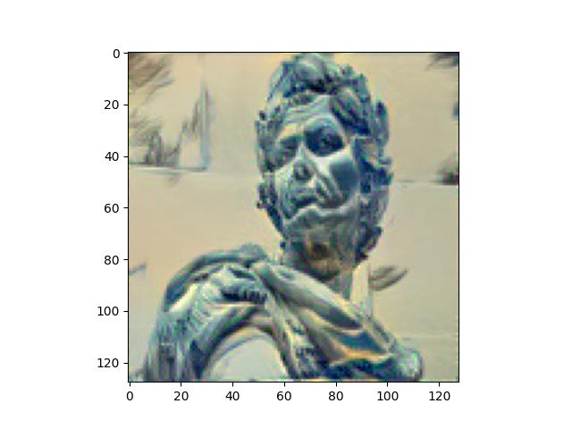
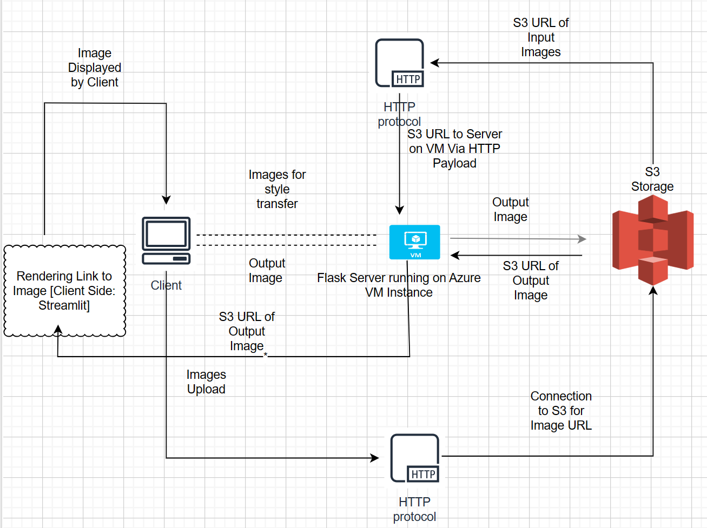

# Style Transfer for design of images 

[Link](https://style-blend.onrender.com/)

## Overview

Style transfer is a deep learning application where the images are mixed according to their features required in final output image. In brief if we want a final image which has color or localised features of image "B" but actual content of image "A" we can use style transfer technique. Here image "B" is known as Style Image and "A" is known as content image.

## Deep Learning Style Transfer

Style transfer is achieved with the help of CNN model (particularly pre-trained VGG model is used).
Please refer STYLE_ART article for details about the process of style transfer.

In above given link, user can add images according to the following type of blend required:

1. **only-style:** If the user wants predefined style with user's content/input. 
2. **style-content:** If the user wants style from user fed image to the model, then two images are required from the user: Content Image and Style Image.
Example: Style Image 
Content Image 
Final Style Transfer Output Image 

3. **new-blend:** If the user wants new output interms of content and style, get content and style from images and imprint on the new input image, in that case three images are required from user: Content Image, Style Image and Input Image.

Also the intensity of style transfer can be increased or decreased based on intensity param (high/low)
## Architecture Diagram

* Please refer to the self-explanatory architecture diagram for the overall design:

## CI/CD Inference via Github Actions
The project implements Deep Learning Inference (backend) via CI/CD on Github Action workflow, so just a push to main branch of the repository will invoke build jobs, hence no need of manual intervention. 

The frontend is hosted on Render.

## References:
1. [PyTorch Implementation](https://pytorch.org/tutorials/advanced/neural_style_tutorial.html)
2. [A Neural Algorithm of Artistic Style
](./STYLE_ART.pdf)
3. [Tensorflow Implementation](https://github.com/lengstrom/fast-style-transfer)

